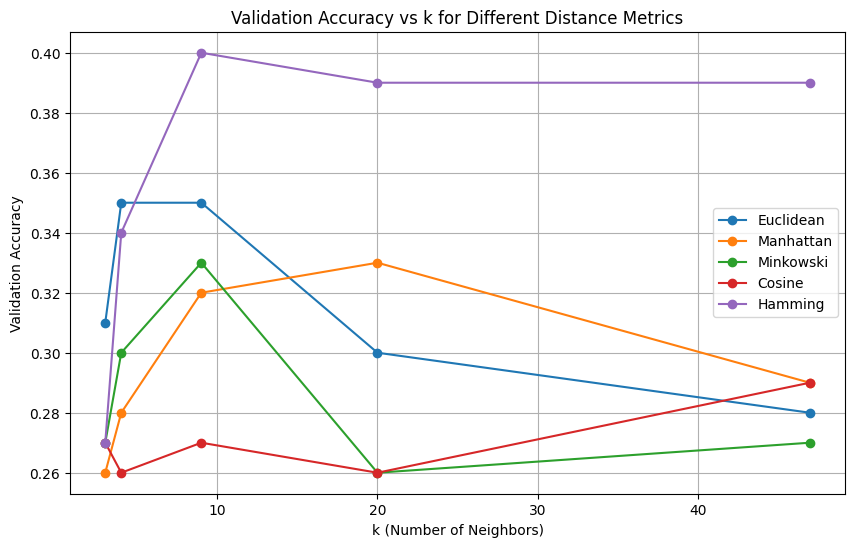
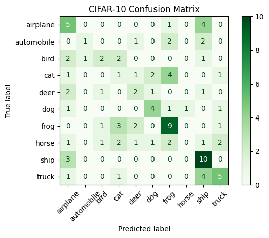
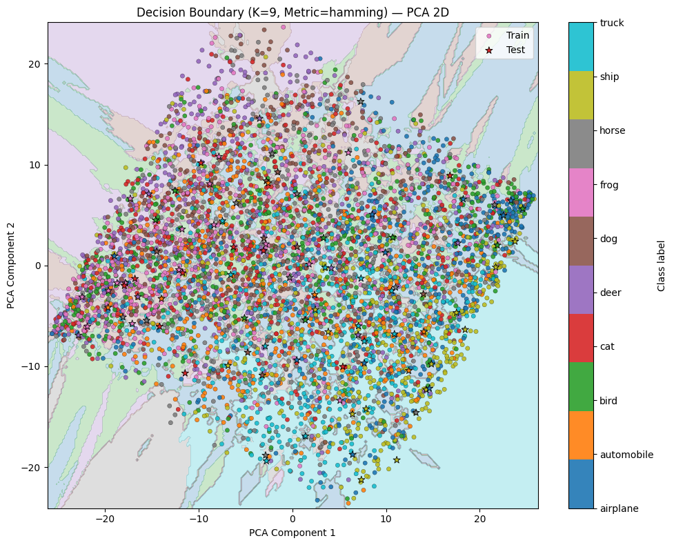

# K-Nearest Neighbors (KNN) Classification on CIFAR-10

This repository contains an implementation of a **K-Nearest Neighbors (KNN) classifier** for **multiclass classification** on the CIFAR-10 dataset. The goal is to evaluate different distance metrics and identify the best `k` value for each metric to maximize classification accuracy.

---

## Dataset

We used a **subset of the CIFAR-10 dataset** for faster training and testing:

- **Training data:** 2,000 samples (from one batch)
- **Test data:** 100 samples (from the test batch)

CIFAR-10 consists of 10 classes: `airplane`, `automobile`, `bird`, `cat`, `deer`, `dog`, `frog`, `horse`, `ship`, `truck`.

---

## Methodology

We trained a KNN classifier using different **distance metrics**:

- Euclidean
- Manhattan
- Minkowski
- Cosine
- Hamming

For each metric, we tested multiple values of `k` to find the one that gives the **highest test accuracy**.

---

## Results

### Best `k` for Each Distance Metric
Below is the summary of the best K value and accuracy obtained for each distance metric used during experimentation:
<p align="center">
  
</p>

| Distance Metric | Best k | Test Accuracy |
|-----------------|--------|---------------|
| Euclidean       | 4      | 0.3500        |
| Manhattan       | 20     | 0.3300        |
| Minkowski       | 9      | 0.3300        |
| Cosine          | 47     | 0.2900        |
| Hamming         | 9      | 0.4000        |

**Observation:**  
The Hamming distance metric achieved the **highest accuracy (40%)** on this subset of CIFAR-10.

---

### Classification Report (Hamming Distance, k=9)
The confusion matrix below shows the count of correctly and incorrectly classified samples.
<p align="center">
  
</p>


| Class       | Precision | Recall | F1-Score | Support |
|------------|-----------|--------|----------|---------|
| airplane   | 0.3125    | 0.5000 | 0.3846   | 10      |
| automobile | 0.5000    | 0.1667 | 0.2500   | 6       |
| bird       | 0.4000    | 0.2500 | 0.3077   | 8       |
| cat        | 0.1111    | 0.1000 | 0.1053   | 10      |
| deer       | 0.2857    | 0.2857 | 0.2857   | 7       |
| dog        | 0.5000    | 0.5000 | 0.5000   | 8       |
| frog       | 0.4737    | 0.5625 | 0.5143   | 16      |
| horse      | 0.0000    | 0.0000 | 0.0000   | 11      |
| ship       | 0.4348    | 0.7692 | 0.5556   | 13      |
| truck      | 0.5000    | 0.4545 | 0.4762   | 11      |

- **Accuracy:** 0.39  
- **Macro Average:** Precision = 0.3518, Recall = 0.3589, F1-Score = 0.3379  
- **Weighted Average:** Precision = 0.3517, Recall = 0.3900, F1-Score = 0.3555
The smooth transitions across boundaries demonstrate the **non-parametric nature of KNN**.

<p align="center">
  
</p>

---

## Notes

- Only a small subset of CIFAR-10 was used for faster experimentation.  
- KNN is computationally expensive for large datasets; for full CIFAR-10, optimizations like **KD-Trees**, **Ball Trees**, or **approximate nearest neighbors** are recommended.  
- The choice of distance metric and `k` significantly affects the performance.

---

## Usage

1. Clone the repository:
```bash
git clone https://github.com/Soma2024-08/Multiclass-Classification-Using-KNN-Classifier
